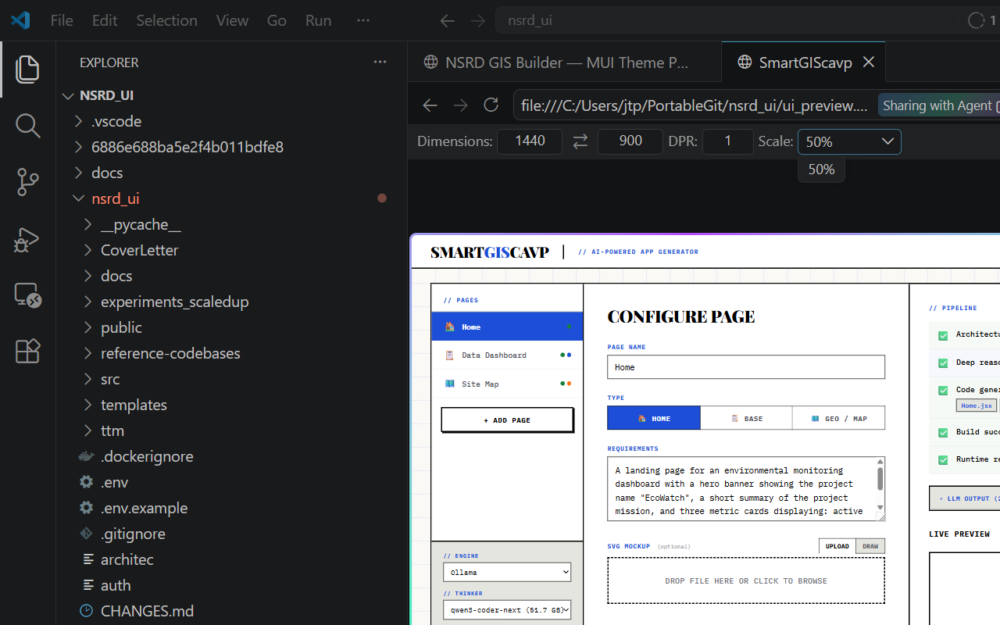

<div align="center">

# SmartGIScavp

### AI-Powered Multi-Page React App Generator

**Write your requirements → LLM thinks + codes → Live React app deployed in seconds**

[](LICENSE)
[](https://reactjs.org)
[](https://typescriptlang.org)
[](https://ollama.ai)
[](https://hub.docker.com/r/jtupayac/nsrd-ui)
[](https://ornl.gov)

</div>

---



---

## What is SmartGIScavp?

SmartGIScavp is a full-stack app builder that lets you **describe** what you want, pick an LLM, and watch a production-quality multi-page React app get generated, built, and served — live — in your browser.

It uses a **Thinker → Coder** dual-model pipeline:

```
Your description
      ↓
  [Thinker LLM]  ← plans architecture, reasons about structure
      ↓
  [Coder LLM]   ← writes all React/JSX files
      ↓
  Vite build    ← compiles & bundles
      ↓
  Runtime review ← LLM checks for crashes, fixes them
      ↓
  Live iframe preview + download
```

Page types supported:
- **Home** — hero banners, metric cards, CTAs
- **Base** — data tables, charts, dashboards  
- **Geo / Map** — Leaflet maps with CSV data, heatmaps, polylines

---

## Quick Start

### Option A — Docker (Recommended)

```bash
git clone https://github.com/jtupayachi/nsrd_ui.git
cd nsrd_ui/nsrd_ui
docker compose up --build
```

Open **http://localhost:8432** in your browser.

> **Port 8432** is exposed. Change it in `docker-compose.yml` → `ports: "XXXX:80"` if needed.

### Option B — Local Development

```bash
cd nsrd_ui
npm install
# Terminal 1 — Express backend
node server.js
# Terminal 2 — React frontend
npm start
```

Frontend → http://localhost:3000  
Backend  → http://localhost:80 (or `PORT` env var)

---

## Connecting Your Ollama Server

All credentials live in **`.env`** — never hardcoded. Copy the template and fill in your values:

```bash
cp nsrd_ui/.env.example nsrd_ui/.env
```

```ini
# .env
OLLAMA_HOST=http://localhost:11434   # or https://your-remote-ollama.example.com
OLLAMA_USER=                         # leave blank for no-auth local installs
OLLAMA_PASSWORD=                     # or set OLLAMA_API_KEY for Bearer token auth
ANTHROPIC_API_KEY=                   # optional — enables Claude models
```

> **Verify your Ollama connection:**
> ```bash
> curl $OLLAMA_HOST/api/tags   # should return JSON with your models
> ollama pull qwen3-coder:30b  # download a model if needed
> ```

---

## Selecting Models in the UI

SmartGIScavp uses two roles:

| Role | Purpose | Recommended |
|---|---|---|
| **Thinker** | Plans architecture, reasons step-by-step | `qwen3-coder-next` · `qwen3:30b` · `llama3.2` |
| **Coder** | Writes all JSX/React files | `qwen3-coder:30b` · `codellama:34b` · `deepseek-coder:33b` |

**Thinker = bigger/smarter model.** Coder = fast code-focused model.

You can use the **same model for both** if compute is limited.

---

## Adding Anthropic Claude

In the UI, switch the **Engine** selector to `Anthropic`. Then set your key in `.env`:

```bash
# nsrd_ui/.env
ANTHROPIC_API_KEY=sk-ant-xxxxxxxxxxxx
```

Supported models: `claude-opus-4-5`, `claude-sonnet-4-5`, `claude-3-5-haiku`

---

## Full Demo Walkthrough

1. **Open** http://localhost:8432
2. **Add a page** — click `+ Add Page` in the sidebar
3. **Name it** and pick a type (Home / Base / Geo / Map)
4. **Describe it** — write natural language requirements, e.g.:
   > *"A dashboard page with a bar chart of species counts by site, a filterable data table, and a header with the project title EcoWatch"*
5. **Upload an SVG mockup** (optional) — draw a wireframe and the LLM will follow it
6. **Upload CSV data** (optional, for Geo pages) — lat/lng columns are detected automatically
7. **Select models** — pick your Thinker and Coder models from the dropdowns
8. **Click Generate & Deploy** — watch the pipeline run in the right panel
9. **Live preview** — the app appears in the iframe when complete
10. **Download** — get a `.tar.gz` of the full source (`npm install && npm run dev` to run it)

---

## Project Structure

```
nsrd_ui/
├── nsrd_ui/                   ← Main application (git root)
│   ├── src/                   ← React frontend (TypeScript)
│   │   ├── App.tsx            ← Main UI component
│   │   ├── App.css            ← Swiss brutalist theme
│   │   └── components/        ← FileUpload, SVGEditor, ModelSelector, TabHealthBadges
│   ├── server.js              ← Express backend + Ollama proxy
│   ├── pipeline.js            ← Thinker→Coder→Build pipeline
│   ├── sanitizer.js           ← LLM output validation & repair
│   ├── referenceAnalyzer_rag.js ← RAG retrieval from golden examples
│   ├── rag_server.py          ← Python FAISS + sentence-transformers
│   ├── templates/react-app/   ← Vite template for generated apps
│   ├── reference-codebases/   ← Golden example components for RAG
│   ├── Dockerfile
│   └── docker-compose.yml
├── docs/
│   ├── screenshots/
│   └── deployment/
└── README.md
```

---

## RAG-Assisted Code Generation

SmartGIScavp includes a **FAISS-based RAG engine** that retrieves relevant golden-example components before generating code. This dramatically improves code quality for charts, maps, and data tables.

The Python microservice runs inside Docker automatically:

```bash
# Manually rebuild the RAG index:
docker exec nsrd-ui python3 rag_server.py
```

Golden examples live in `reference-codebases/golden-examples/src/` — add your own `.jsx` files there to extend what the LLM can reference.

---

## Environment Variables

| Variable | Default | Description |
|---|---|---|
| `OLLAMA_HOST` | `http://localhost:11434` | Ollama server URL |
| `OLLAMA_USER` | *(blank)* | Basic auth username |
| `OLLAMA_PASSWORD` | *(blank)* | Basic auth password |
| `OLLAMA_API_KEY` | *(blank)* | Bearer token (alternative to basic auth) |
| `ANTHROPIC_API_KEY` | *(blank)* | Enable Anthropic Claude |
| `PORT` | `80` | Express backend port |
| `VIRTUAL_HOST` | *(blank)* | nginx-proxy reverse-proxy hostname |

See `nsrd_ui/.env.example` for a full annotated template.

---

## Deployment

### Behind a reverse proxy (nginx-proxy)

```yaml
# docker-compose.yml
environment:
  - VIRTUAL_HOST=your-domain.example.com
  - LETSENCRYPT_HOST=your-domain.example.com
```

### Custom port

```yaml
ports:
  - "9000:80"   # expose on port 9000
```

### Production build only (no volume mounts)

```bash
docker build -t smartgiscavp .
docker run -p 8432:80 smartgiscavp
```

---

## Architecture

```
Browser
  │
  ├─ React 18 (TypeScript) — SmartGIScavp UI
  │     └─ src/App.tsx · components/
  │
  └─ Express.js server (server.js)
        ├─ POST /api/pipeline/run     → start generation job
        ├─ GET  /api/pipeline/stream/:id → SSE event stream
        ├─ GET  /api/models           → proxy Ollama /api/tags
        ├─ POST /api/pipeline/clarify → answer model questions
        └─ GET  /preview/:id/         → serve generated app
              │
              ├─ pipeline.js
              │     ├─ [Thinker LLM] architectural reasoning
              │     ├─ [Coder LLM]   JSX code generation
              │     ├─ Vite build
              │     └─ Runtime review + auto-fix
              │
              ├─ referenceAnalyzer_rag.js ← RAG lookups
              │
              └─ rag_server.py (FastAPI + FAISS)
                    └─ sentence-transformers embeddings
```

---

## Tech Stack

| Layer | Technology |
|---|---|
| Frontend | React 18 · TypeScript · IBM Plex Mono · Playfair Display |
| Backend | Node.js · Express.js · SSE streaming |
| LLM | Ollama · Anthropic Claude · LangChain.js |
| Build | Vite · Tailwind CSS (generated apps) |
| RAG | Python · FastAPI · FAISS · sentence-transformers |
| Deploy | Docker · nginx |

---

## Sponsorship & Collaboration

SmartGIScavp is an active R&D project at **Oak Ridge National Laboratory** exploring the intersection of large language models, geospatial computing, and scientific app generation.

We are seeking **DOE program sponsors and research partners** to scale this work. Potential collaboration areas include:

- 🏛️ **DOE Office of Science** — integrating SmartGIScavp into scientific data workflows and user facilities
- 🗺️ **Geospatial intelligence** — extending multi-page app generation to real-time sensor and satellite data
- 🤖 **LLM infrastructure** — co-developing domain-specific fine-tuned models for scientific code generation
- 🔒 **Secure deployments** — air-gapped, on-premise builds for classified or sensitive environments

If your program could benefit from AI-assisted rapid application development for scientific data, we would love to connect.

| Contact | Link |
|---|---|
| **Xiao-Ying Yu, Ph.D.** — PI, ORNL | [Staff Profile](https://www.ornl.gov/staff-profile/xiao-ying-yu) |
| **Jose Tupayachi** — Developer | [jtupayachi.github.io](https://jtupayachi.github.io/) |
| **Repository** | [github.com/jtupayachi/nsrd_ui](https://github.com/jtupayachi/nsrd_ui) |
| **Container** | [hub.docker.com/r/jtupayac/nsrd-ui](https://hub.docker.com/r/jtupayac/nsrd-ui) |

> Pull requests and golden example components (`reference-codebases/golden-examples/src/`) are always welcome — high-quality React components directly improve LLM output quality for all users.

---

## License

MIT © Oak Ridge National Laboratory

---

<div align="center">

| | |
|:---:|:---:|
| **PI** | [Xiao-Ying Yu, Ph.D.](https://www.ornl.gov/staff-profile/xiao-ying-yu) · Oak Ridge National Laboratory |
| **Dev** | [Jose Tupayachi](https://jtupayachi.github.io/) · UTK / ORNL |
| **Container** | [`docker pull jtupayac/nsrd-ui`](https://hub.docker.com/r/jtupayac/nsrd-ui) |

<br/>


<sub>Scan to open the repo · SmartGIScavp · Oak Ridge National Laboratory</sub>

</div>
