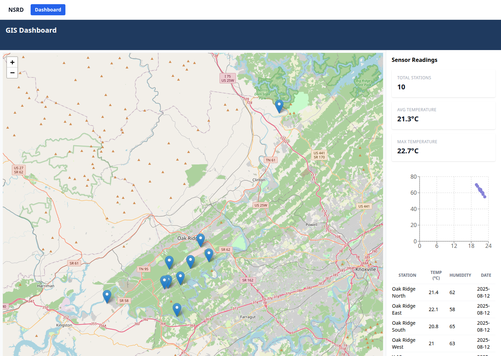

# Deployed Example — NSRD GIS Dashboard

This page shows a **completed, live dashboard** generated and deployed by the
**NSRD GIS Builder** prototype (`jtupayac/nsrd-ui`). It is a real project served
by the running container at `/preview/<projectId>/`.

---

## Live GIS monitoring dashboard



The screenshot above is a fully functional single-page GIS dashboard produced by
the builder from a plain-English requirement. Everything in it — the interactive
map, the summary statistics, the chart, and the data table — was generated and
wired together automatically.

### What the dashboard contains

| Element | Description |
|---------|-------------|
| **Interactive map** | A Leaflet + OpenStreetMap map centered on Oak Ridge, TN, with ten monitoring **station markers** placed from the source data. Pan/zoom and marker interaction are fully working. |
| **Sensor Readings panel** | Live summary **stat cards** — Total Stations (10), Avg Temperature (21.3 °C), Max Temperature (22.7 °C) — computed from the dataset. |
| **Scatter chart** | A temperature/humidity distribution plot rendered from the same readings. |
| **Data table** | A per-station table (station, temperature, humidity, date) that stays in sync with the map. |
| **Top navigation** | A `NSRD` header with a `Dashboard` tab; multi-page apps expose one tab per page. |

### How it was produced

1. The user described the page in the builder's **Requirements** box (a geospatial
   monitoring dashboard with a map, summary metrics, a chart, and a station table).
2. The **RAG engine** retrieved matching patterns from the baked-in reference
   codebases (Leaflet maps, stat cards, Recharts, data tables).
3. The **Thinker → Coder** model pipeline planned the layout and generated the
   React/JSX components.
4. The project was **built with Vite** and **deployed** inside the container,
   served live under `/preview/<projectId>/`.

### View it yourself

With the container running (see the [Deployment Guide](DEPLOYMENT.md)):

```bash
# List deployed projects inside the container
docker exec nsrd-ui sh -c 'ls -d /app/projects/*/dist/index.html'

# Open a deployed dashboard in the browser (replace with a real project id)
#   http://localhost:8432/preview/<projectId>/
```

> Tip: many generated apps are **multi-page** — click the tabs in the top nav
> (e.g. `Home`, `List`, `Stats`, `Dashboard`) to switch between the generated
> pages and reveal their content.

---

See also: [User Guide](../user-guide/USER_GUIDE.md) · [Deployment Guide](DEPLOYMENT.md)
