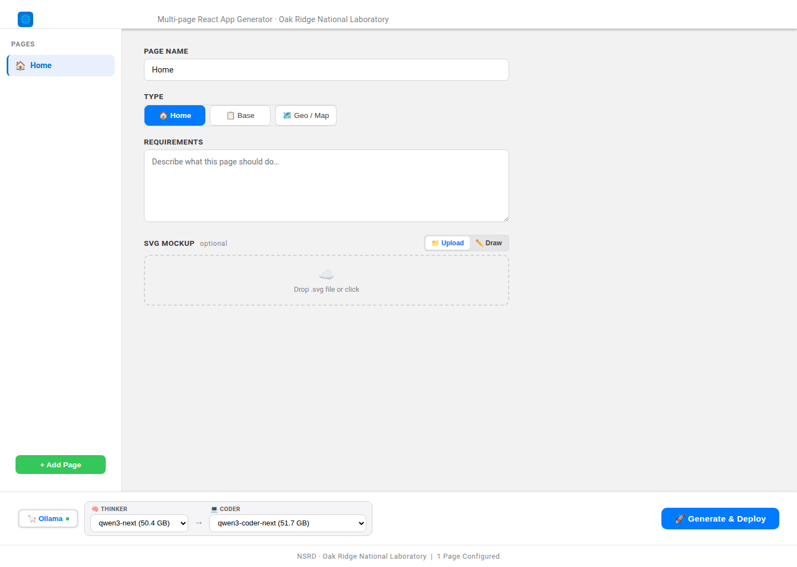
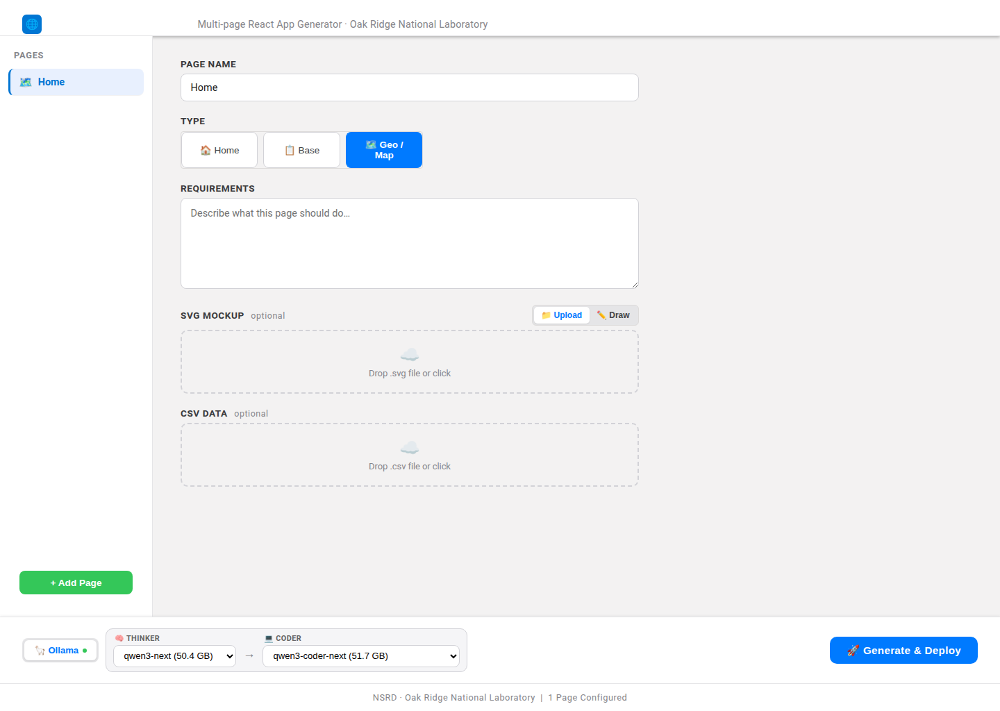
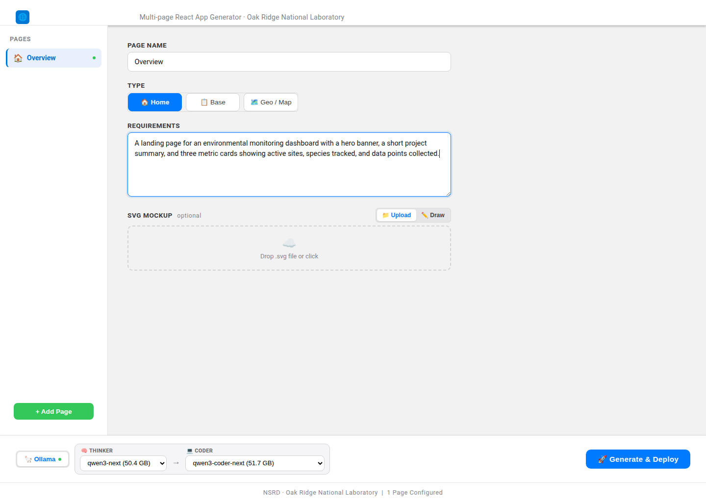
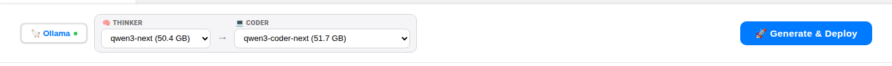
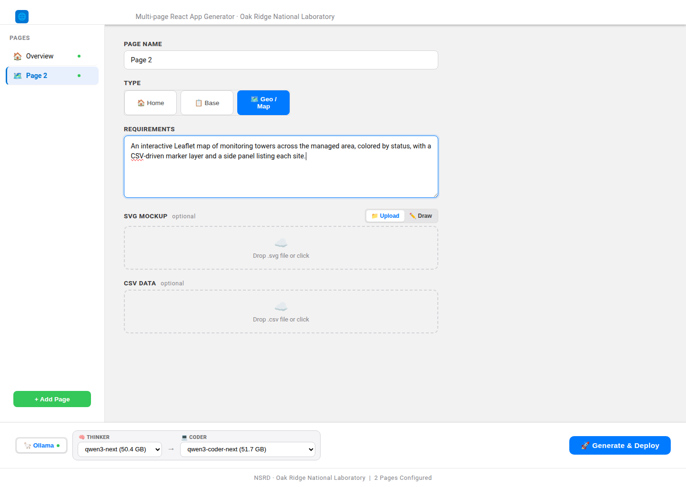

# NSRD GIS Builder — User Guide

**NSRD GIS Builder** is a multi-page React application generator from Oak Ridge
National Laboratory. You describe the pages you want in plain English, pick an
AI model pair, and the tool generates and deploys a live, multi-page React app —
complete with maps, charts, tables, and dashboards.

> Live prototype (self-contained Docker image): open **http://localhost:8432**
> after running the container (see the [Deployment Guide](../deployment/DEPLOYMENT.md)).

---

## Table of contents

1. [The interface at a glance](#1-the-interface-at-a-glance)
2. [Choosing a page type](#2-choosing-a-page-type)
3. [Writing requirements](#3-writing-requirements)
4. [Selecting AI models](#4-selecting-ai-models)
5. [Building a multi-page app](#5-building-a-multi-page-app)
6. [Generating & deploying](#6-generating--deploying)
7. [Tips for great results](#7-tips-for-great-results)
8. [FAQ](#8-faq)

---

## 1. The interface at a glance

When you open the app you'll see three main regions: the **Pages** sidebar (left),
the **page editor** (center), and the **model + generate** control bar (bottom).

| Region | What it does |
|--------|--------------|
| **Pages** (left) | Lists every page in your app. Use **+ Add Page** to add more. |
| **Page editor** (center) | Set the page **name**, **type**, **requirements**, and an optional **SVG mockup**. |
| **Control bar** (bottom) | Pick the AI engine and the Thinker → Coder models, then **🚀 Generate & Deploy**. |
| **Footer** | Shows how many pages are currently configured. |

---

## 2. Choosing a page type

Each page has a **type** that tells the generator what kind of UI to build:

| Type | Use it for |
|------|-----------|
| 🏠 **Home** | Landing pages — hero banners, summaries, metric cards, navigation. |
| 📋 **Base** | General content pages — tables, forms, text, generic dashboards. |
| 🗺️ **Geo / Map** | Interactive Leaflet maps — markers, layers, heatmaps, GeoJSON, CSV-driven points. |

When you select **Geo / Map**, an area to attach a CSV of coordinates appears so
your map can be driven by real data (latitude/longitude columns).

---

## 3. Writing requirements

The **Requirements** box is where you describe, in plain English, what the page
should contain and do. Be specific about layout, data, and interactions.

**Example (Home page):**

> A landing page for an environmental monitoring dashboard with a hero banner, a
> short project summary, and three metric cards showing active sites, species
> tracked, and data points collected.

You can optionally attach an **SVG mockup** (upload a file or draw one) to guide
the visual layout — the generator uses it as a design reference.

---

## 4. Selecting AI models

Generation uses a **two-model pipeline** shown in the control bar:

- **🦙 Ollama** — the inference engine (self-hosted Viridian Ollama gateway).
- **🧠 Thinker** — the reasoning model that plans the app structure and page logic.
- **💻 Coder** — the code model that writes the actual React/JSX components.

Pick any available model in each dropdown (sizes are shown, e.g. `qwen3-coder-next
(51.7 GB)`). A capable Thinker plus a strong Coder generally gives the best
results. The model lists are fetched live from the Ollama server.

---

## 5. Building a multi-page app

Real dashboards need several pages. Click **+ Add Page** in the sidebar to add
another page, then set its type and requirements independently. For example, add
a **Geo / Map** page alongside your Home page:

**Example (Map page):**

> An interactive Leaflet map of monitoring towers across the managed area,
> colored by status, with a CSV-driven marker layer and a side panel listing
> each site.

The generator wires up navigation between all configured pages automatically, so
the output is a single cohesive multi-page React app.

---

## 6. Generating & deploying

1. Confirm each page has a **name**, **type**, and **requirements**.
2. Choose your **Thinker** and **Coder** models.
3. Click **🚀 Generate & Deploy**.

The pipeline then:

1. Retrieves relevant patterns from the **RAG** index of reference codebases.
2. **Plans** the app with the Thinker model.
3. **Generates** each page's components with the Coder model.
4. **Builds** the Vite + React project and **deploys** it.
5. Serves the live app at a preview URL (`/preview/<projectId>/`), which is shown
   in the UI when generation completes.

Progress streams live in the UI. You can disconnect and reconnect without losing
progress — the run continues server-side.

---

## 7. Tips for great results

- **Be concrete.** "Three metric cards: active sites, species tracked, data
  points" beats "some stats".
- **Name your data columns.** For map/chart pages, mention the CSV columns
  (e.g. `latitude`, `longitude`, `status`) so the generator binds them correctly.
- **One responsibility per page.** Split a big dashboard into focused pages
  (overview, map, time series) for cleaner output.
- **Attach a mockup** when you have a specific layout in mind.
- **Match models to the task.** Larger coder models handle complex,
  data-heavy pages better.

---

## 8. FAQ

**Q: The dropdowns are empty / Generate does nothing.**
The app couldn't reach the Ollama LLM gateway. Check that the container has
outbound HTTPS to `ollama.viridian.ise.utk.edu` and review `docker logs nsrd-ui`.

**Q: Where do generated apps go?**
Into `/app/projects/<projectId>` inside the container, served under
`/preview/<projectId>/`. Mount a volume on `/app/projects` to persist them.

**Q: Does the tool need internet for the RAG/search step?**
No. The embedding model and FAISS index are baked into the image, so retrieval
works fully offline. Only the LLM generation step calls the external Ollama
endpoint.

**Q: How do I run it?**
See the [Deployment Guide](../deployment/DEPLOYMENT.md) —
`docker run -d -p 8432:80 jtupayac/nsrd-ui:latest`.
